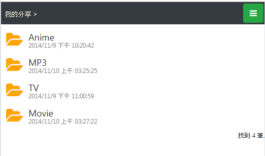
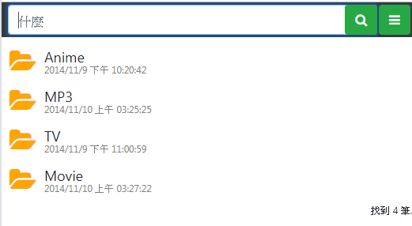

    

# WhatSearch
### screenshot-01

### screenshot-02

  
可以設定要可被搜尋的目錄名稱  
提供介面查詢  

這是要讓朋友找，我FTP裏有哪些東西啦  

# 0.5.6
編輯文字與上傳  

# 0.5.5
上傳區的私人區，再多一個私人(分享區)
secret多一組6位英數亂碼，方便記憶分享

# 0.5.4
上傳image.jpg會自動更名為image20211202_001.jpg 類推

# 0.5.3
/upload "公共區"檔案上傳
支援HttpUpload
curl.exe http://localhost:7777/upload/1.jpg --upload-file c:\temp\1.jpg

# 0.5.2
/upload 檔案上傳改成可多檔上傳  
其中圖片不強制下載，而可顯示  

# 0.5.1
merge images 調整版型，至少要在iphone12上堪用

# 0.5
試作 merge images

# 0.4.1.2
修正admin更新功能

# 0.4.1.1
整合 mmplay 的 Like,Dislike 統一用like來記錄即可
like = 1
like = 0
like = -1 (dislike)

# 0.4.1
mmplay 的 Like and Dislike

# 0.4
試作 mmplay

# 0.3.6
1. 修正播放音樂時，無檔案存取權限時，未導向line登入
2. 增加為每個分享目錄，可設定是否 protected

# 0.3.5
調整播放音樂檔的方式，現在不是另開視窗播放，而是在原頁面一首一首播

# 0.3.4
上傳功能，實作私人上傳，路徑用guid讓其他人猜不到

# 0.3.3
上傳功能，實作可續傳。

# 0.3.2
上傳功能

# 0.3.1.1
滑鼠移動也會影響畫面上選擇的項目

# 0.3.1
增加鍵盤方向鍵控制

# 0.3.0.3
修正搜尋時用大寫搜尋不到

# 0.3.0.2
config提供搜尋回傳筆數的限制設定

# 0.3
會員認證，目前用Line串接登入
版面M版優先
提供管理者，會員允許功能

# 0.2.4
搜尋時顯示目錄

# 0.2.3.4
github建議昇級.net core版本，於是昇級到 2.1.5

# 0.2.3.3
調整page的網址格式

# 0.2.3.2
增加設定play的ip白名單

# 0.2.3.1
修正建立lucene資料時，多緒下的衝突

# 0.2.3
config增加playtypes設定，可下載檔案的類型

# 0.2.2
調整rss的route

# 0.2.1  
試用Markdown  
/about 顯示說明  

# 0.2.0
現在可以退回上頁  

# 0.1.1  
加入 rss 訂閱(初版)  

# 可能會加上的功能
搜尋結果樣式調整
下載檔案
可指定 querystring 開啟特定檔案頁面  
跟 FileZilla 的帳號整合  

# Bugs
-- 目錄搬移的資料，搜尋會失敗 /api/search 回傳的 items 裏有  null 的回傳資料
- WhatName 無法搜尋 Disenchantment
- Convert MKV to MP4, and keep forced subs.
- 

# 感謝

[github-markdown-css](https://github.com/sindresorhus/github-markdown-css)  
[MimeTypeMap](https://github.com/samuelneff/MimeTypeMap)  
[line-login-sdk-csharp](https://github.com/kenakamu/line-login-sdk-csharp/tree/master/line-login-csharp) 